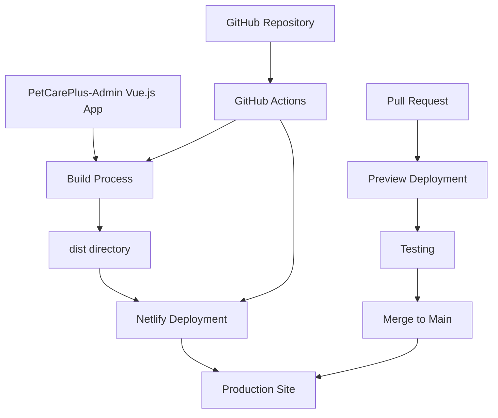

# Hosting Recommendations for PetCarePlus-Admin

## Executive Summary

After thorough research of free hosting options for the PetCarePlus-Admin Vue.js application, **Netlify** is recommended as the optimal solution. This recommendation is based on its simple deployment process, comprehensive feature set, generous free tier, and excellent support for Vue.js applications.

## Key Requirements Analysis

The PetCarePlus-Admin application has the following hosting requirements:

| Requirement | Support in Recommended Solution (Netlify) |
|-------------|------------------------------------------|
| Static file hosting | ✅ Excellent support for Vite-built applications |
| SPA routing | ✅ Simple configuration with `_redirects` file |
| HTTPS support | ✅ Automatic SSL certificates included |
| Environment variables | ✅ Easy configuration through dashboard or CLI |
| GitHub Actions integration | ✅ Native GitHub integration with optional Actions workflow |
| Free tier | ✅ Generous limits (100GB bandwidth, 300 build minutes) |
| Simple deployment | ✅ Connect repository, configure build settings, deploy |

## Top Hosting Options Comparison

| Feature | Netlify | Vercel | GitHub Pages |
|---------|---------|--------|--------------|
| **Free Tier Bandwidth** | 100GB/month | 100GB/month | 100GB/month |
| **Build Minutes** | 300/month | Unlimited | Unlimited via Actions |
| **SPA Routing** | Simple configuration | Built-in support | Requires workarounds |
| **HTTPS** | Automatic | Automatic | Automatic |
| **Env Variables** | Dashboard/CLI | Dashboard/CLI | GitHub Secrets only |
| **Deployment Simplicity** | Very High | Very High | Medium |
| **Custom Domain** | Free | Free | Free |
| **CDN** | Global | Global | Global |

## Why Netlify?

1. **Simplest deployment process** - Connect your GitHub repository and deploy with minimal configuration
2. **Excellent SPA routing support** - Automatic handling with a simple redirects file
3. **Easy environment variable management** - Intuitive dashboard for configuration
4. **Automatic HTTPS** - SSL certificates provided and renewed automatically
5. **Preview deployments** - Automatic preview deployments for pull requests
6. **Form handling** - Built-in form handling if needed in the future
7. **Serverless functions** - Option to add backend functionality if needed later

## Implementation Resources

We've prepared comprehensive documentation to help you implement this recommendation:

1. [Hosting Options Analysis](./hosting-options-analysis.md) - Detailed comparison of all options
2. [Netlify Deployment Guide](./netlify-deployment-guide.md) - Step-by-step deployment instructions
3. [GitHub Actions Workflow](./github-actions-netlify-workflow.md) - CI/CD configuration for automated deployment

## Deployment Process Overview

## Next Steps

1. **Create a Netlify account** (free) if you don't already have one
2. **Connect your GitHub repository** to Netlify
3. **Configure build settings**:
   - Build command: `npm run build`
   - Publish directory: `dist`
4. **Add environment variables** from your `.env.production` file
5. **Deploy your site** with a single click
6. **Set up GitHub Actions** (optional) for more control over the build process

## Long-term Considerations

While the free tier of Netlify should be sufficient for the PetCarePlus-Admin application, consider these factors for future planning:

1. **Usage monitoring** - Keep an eye on bandwidth and build minutes usage
2. **Custom domain** - Consider adding a custom domain for production use
3. **Paid upgrades** - If you exceed free tier limits, Netlify's starter plan is $19/month
4. **Alternative options** - Vercel is an excellent alternative with similar features and pricing

## Conclusion

Netlify provides the ideal balance of simplicity, features, and cost (free) for hosting the PetCarePlus-Admin Vue.js application. Its intuitive deployment process, excellent SPA routing support, and seamless GitHub integration make it the recommended choice for your project.