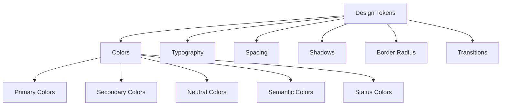
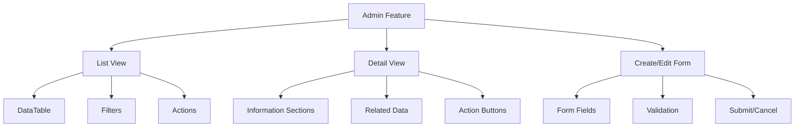

# PetCare+ Admin Dashboard Implementation Plan

## Overview

This document outlines the implementation plan for updating the UI consistency/theming and implementing admin dashboard tabs based on the backend controllers for the PetCare+ Admin Dashboard.

## Table of Contents

1. [Current State Analysis](#current-state-analysis)
2. [UI Consistency and Theming](#ui-consistency-and-theming)
3. [Admin API Services](#admin-api-services)
4. [Admin Feature Components](#admin-feature-components)
5. [Router Configuration](#router-configuration)
6. [Implementation Strategy](#implementation-strategy)
7. [Timeline Estimation](#timeline-estimation)

## Current State Analysis

### Technology Stack
- Vue.js 3 with TypeScript
- Tabler.io as the UI framework (@tabler/core)
- Pinia for state management
- Vue Router for navigation
- Axios for API calls

### Current UI/Styling
- Basic CSS variables in base.css
- Minimal styling in main.css
- No comprehensive design token system
- Components like DataTable.vue exist but may need styling consistency

### Backend Controllers to Implement
- AdminBookingController
- AdminDefaultServiceController
- AdminTermsController
- AdminUserController
- AdminWithdrawalController

### Existing Features
- Authentication system
- Router with role-based access control
- Some admin routes already exist (users, settings)
- DataTable component for displaying tabular data

## UI Consistency and Theming

### Design Token System



#### Colors
- Primary: Brand colors for primary actions and emphasis
- Secondary: Supporting colors for secondary actions
- Neutral: Grayscale colors for text, backgrounds, and borders
- Semantic: Colors for success, warning, error, and info states
- Status: Colors for specific status indicators (e.g., pending, approved, rejected)

#### Typography
- Font families: Primary and secondary fonts
- Font sizes: Heading and body text sizes
- Font weights: Regular, medium, bold
- Line heights: For different text elements
- Letter spacing: For different text elements

#### Spacing
- Base unit: 4px or 8px
- Spacing scale: 0, 0.25, 0.5, 1, 1.5, 2, 3, 4, 5, 6, etc.
- Component spacing: Consistent spacing between components

#### Shadows
- Elevation levels: Different shadow depths for different elevations
- Focus states: Shadows for focused elements

#### Border Radius
- Small: For buttons, inputs, etc.
- Medium: For cards, modals, etc.
- Large: For floating panels, etc.

#### Transitions
- Duration: Standard durations for animations
- Easing: Standard easing functions for animations

### Implementation of Design Tokens

1. Create a new `tokens.css` file with all design tokens as CSS variables
2. Update `base.css` to use these tokens
3. Ensure all components use these tokens for styling
4. Add support for both light and dark modes

### Component Style Guide

Define consistent styles for:
1. Buttons (primary, secondary, tertiary, danger)
2. Form elements (inputs, checkboxes, selects, etc.)
3. Cards and containers
4. Tables and data display
5. Navigation elements
6. Status indicators and badges

## Admin API Services

### AdminBookingService
- `getAllBookings(params)`: Get all bookings with pagination and filtering
- `getBookingById(id)`: Get booking details by ID

### AdminDefaultServiceService
- `getAllServices(params)`: Get all services with pagination
- `getServiceById(id)`: Get service by ID
- `createService(data)`: Create a new service
- `updateService(id, data)`: Update a service
- `deleteService(id)`: Delete a service
- `searchServicesAdvanced(params)`: Advanced search for services

### AdminTermsService
- `createTerms(data)`: Create new terms
- `updateTerms(id, data)`: Update terms
- `getTermsByType(type, language)`: Get terms by type and language
- `getAllTerms(language)`: Get all terms for a specific language
- `getAllTermsAllLanguages()`: Get all terms for all languages

### AdminUserService
- `getAllUsers(params)`: Get all users with pagination and filtering
- `getUserById(id)`: Get user by ID
- `updateUser(id, data)`: Update user information
- `changeUserRole(id, role)`: Change user role
- `toggleUserBlockStatus(id, blocked)`: Block/unblock user

### AdminWithdrawalService
- `getAllWithdrawals(params)`: Get all withdrawals with pagination
- `approveWithdrawal(id, note)`: Approve a withdrawal request
- `rejectWithdrawal(id, reason)`: Reject a withdrawal request
- `completeWithdrawal(id, note)`: Mark withdrawal as completed

### TypeScript Interface Definitions
- Create interfaces for all request and response types
- Ensure type safety throughout the application
- Document the interfaces for better developer experience

## Admin Feature Components

### Common Component Structure for Each Feature



### Specific Components for Each Feature

#### Bookings Management
- **BookingListView**: DataTable with filters (status, payment status, date range)
- **BookingDetailView**: Booking information, customer details, service details
- **Actions**: View details

#### Users Management
- **UserListView**: DataTable with filters (role, status, search)
- **UserDetailView**: User information, activity history
- **UserEditForm**: Edit user information
- **Actions**: Edit, block/unblock, change role

#### Services Management
- **ServiceListView**: DataTable with filters (price range, search)
- **ServiceDetailView**: Service information, pricing details
- **ServiceCreateEditForm**: Create/edit service form
- **Actions**: Create, edit, delete

#### Terms Management
- **TermsListView**: List by language and type
- **TermsDetailView**: Terms content, version history
- **TermsCreateEditForm**: Create/edit terms form
- **Actions**: Create, edit

#### Withdrawals Management
- **WithdrawalListView**: DataTable with status filters
- **WithdrawalDetailView**: Withdrawal information, transaction details
- **Actions**: Approve, reject, complete

### Reusable Components
- **FilterPanel**: Reusable filter panel for all list views
- **ActionMenu**: Dropdown menu for actions
- **StatusBadge**: Visual indicator for status
- **ConfirmationModal**: For confirming destructive actions
- **FormFields**: Reusable form field components

## Router Configuration

```typescript
// Admin routes
{
  path: '/admin',
  component: () => import('@/layouts/AdminLayout.vue'),
  meta: { requiresAuth: true, roles: ['ADMIN'] },
  children: [
    {
      path: 'bookings',
      name: 'admin-bookings',
      component: () => import('@/features/admin/bookings/pages/BookingsView.vue'),
      meta: { title: 'Admin Bookings' }
    },
    {
      path: 'bookings/:id',
      name: 'admin-booking-detail',
      component: () => import('@/features/admin/bookings/pages/BookingDetailView.vue'),
      meta: { title: 'Booking Detail' }
    },
    {
      path: 'services',
      name: 'admin-services',
      component: () => import('@/features/admin/services/pages/ServicesView.vue'),
      meta: { title: 'Admin Services' }
    },
    {
      path: 'services/create',
      name: 'admin-service-create',
      component: () => import('@/features/admin/services/pages/ServiceCreateView.vue'),
      meta: { title: 'Create Service' }
    },
    {
      path: 'services/:id',
      name: 'admin-service-detail',
      component: () => import('@/features/admin/services/pages/ServiceDetailView.vue'),
      meta: { title: 'Service Detail' }
    },
    {
      path: 'services/:id/edit',
      name: 'admin-service-edit',
      component: () => import('@/features/admin/services/pages/ServiceEditView.vue'),
      meta: { title: 'Edit Service' }
    },
    {
      path: 'terms',
      name: 'admin-terms',
      component: () => import('@/features/admin/terms/pages/TermsView.vue'),
      meta: { title: 'Admin Terms' }
    },
    {
      path: 'terms/create',
      name: 'admin-terms-create',
      component: () => import('@/features/admin/terms/pages/TermsCreateView.vue'),
      meta: { title: 'Create Terms' }
    },
    {
      path: 'terms/:id',
      name: 'admin-terms-detail',
      component: () => import('@/features/admin/terms/pages/TermsDetailView.vue'),
      meta: { title: 'Terms Detail' }
    },
    {
      path: 'terms/:id/edit',
      name: 'admin-terms-edit',
      component: () => import('@/features/admin/terms/pages/TermsEditView.vue'),
      meta: { title: 'Edit Terms' }
    },
    {
      path: 'users',
      name: 'admin-users',
      component: () => import('@/features/admin/users/pages/UsersView.vue'),
      meta: { title: 'Admin Users' }
    },
    {
      path: 'users/:id',
      name: 'admin-user-detail',
      component: () => import('@/features/admin/users/pages/UserDetailView.vue'),
      meta: { title: 'User Detail' }
    },
    {
      path: 'users/:id/edit',
      name: 'admin-user-edit',
      component: () => import('@/features/admin/users/pages/UserEditView.vue'),
      meta: { title: 'Edit User' }
    },
    {
      path: 'withdrawals',
      name: 'admin-withdrawals',
      component: () => import('@/features/admin/withdrawals/pages/WithdrawalsView.vue'),
      meta: { title: 'Admin Withdrawals' }
    },
    {
      path: 'withdrawals/:id',
      name: 'admin-withdrawal-detail',
      component: () => import('@/features/admin/withdrawals/pages/WithdrawalDetailView.vue'),
      meta: { title: 'Withdrawal Detail' }
    }
  ]
}
```

## State Management with Pinia

Example store structure for Admin Bookings:

```typescript
// Admin Bookings Store
export const useAdminBookingsStore = defineStore('adminBookings', {
  state: () => ({
    bookings: [],
    currentBooking: null,
    loading: false,
    error: null,
    pagination: {
      page: 1,
      size: 10,
      total: 0
    },
    filters: {
      status: null,
      paymentStatus: null,
      query: ''
    }
  }),
  actions: {
    async fetchBookings() { /* implementation */ },
    async fetchBookingById(id) { /* implementation */ },
    setFilters(filters) { /* implementation */ },
    setPagination(pagination) { /* implementation */ }
  },
  getters: {
    filteredBookings: (state) => /* implementation */
  }
})
```

Similar store structures will be created for other admin features.

## Implementation Strategy

### Phase 1: Design System Setup (2-3 days)
- Create design tokens and CSS variables
- Update existing components to use the new design system
- Create component style guide

### Phase 2: API Services (2-3 days)
- Create admin API services for all endpoints
- Implement error handling and response formatting
- Add TypeScript interfaces for all request/response types

### Phase 3: Admin Features (8-10 days)
Implement each admin feature in the following order:
1. Bookings Management (1-2 days)
2. Users Management (1-2 days)
3. Services Management (2-3 days)
4. Terms Management (2 days)
5. Withdrawals Management (2 days)

### Phase 4: Testing and Refinement (2-3 days)
- Test all features with mock data
- Refine UI/UX based on testing
- Ensure responsive design works on all screen sizes

## Technical Considerations

### Performance Optimization
- Implement lazy loading for all routes
- Use pagination and filtering on the server side
- Optimize component rendering with Vue's built-in features

### Error Handling
- Create consistent error handling across all API calls
- Implement user-friendly error messages
- Add retry mechanisms for network failures

### Accessibility
- Ensure all components meet WCAG 2.1 AA standards
- Implement keyboard navigation
- Add proper ARIA attributes

## Timeline Estimation

- **Design System Setup**: 2-3 days
- **API Services Implementation**: 2-3 days
- **Admin Features Implementation**: 8-10 days (1-2 days per feature)
- **Testing and Refinement**: 2-3 days

**Total estimated time**: 14-19 days